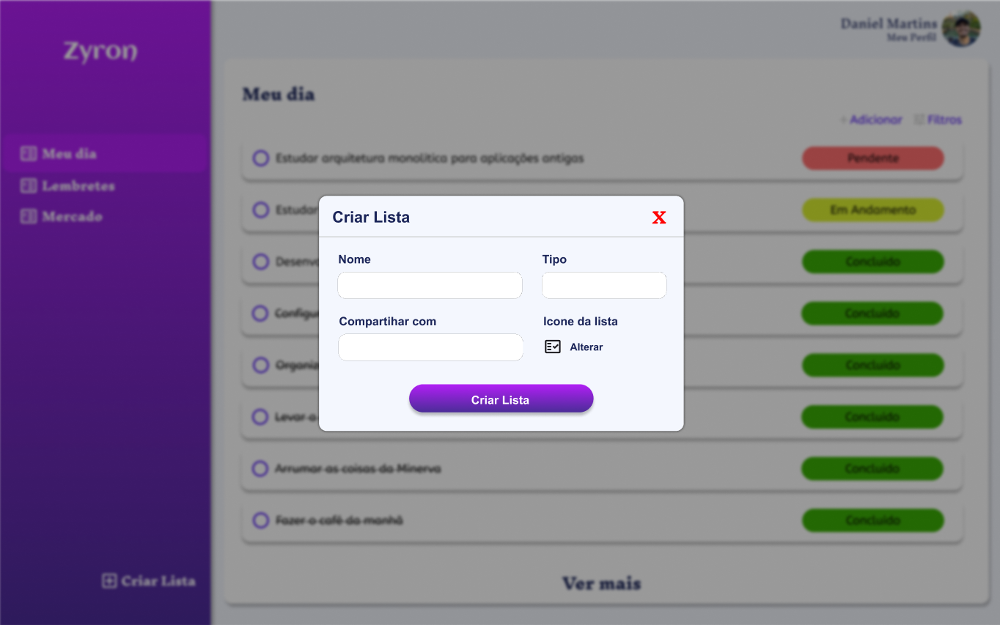

## Zyron - Ferramenta de produtividade

## O que falta desenvolver ?

### Paginas & POP-UPS
- POP-UP de registro de lista

- POP-UP de edição de lista

- POP-UP de edição de tarefas

- POP-UP de registro de tarefas
- Página de Perfil do Usuário
- Página de registro de usuário
- Molde de notificações
- Colocar um check-box dentro de cada item da tarefa
- Colocar os termos de uso do aplicativo na página de login para o usuario aceitar quando criar a conta
- Desenvolver todo o dashboard
- Deixar o conteudo dos STATUS FIXOS

### Outros
- Lógica de listagem de tarefas por status via GET
- Lógica de criar/editar lista via GET
- Lógica de criar/editar tarefas via GET
- Banco de dados e Tabelas
- Todo o back-end

### BUGS PARA RESOLVER 
1. Componente do STATUS esta ficando em cima do texto da tarefa em telas menores
2. Quando clica em criar lista ele redireciona o usuario para o dashboard, porém, não pode fazer isso, ele deve manter o usuario na página em que ele esteja.
3. Quando passa o mouse sobre algum item da lista do menu lateral, ele só deixa clicar quando o mouse esta sobre o texto, colocar para deixar clicar em todo o container daquele item.
4. Transformar todos os containers em componentes(atomos)

### Pendências da página de login:
- Falta adicionar um **ACTION** e um **METHOD** no formulário
- Falta adicionar os **HREF** das tags <a> "Esqueci minha senha" e "Clique Aqui"
- Falta fazer todo o back-end, principalmente a parte de validação e sanitização dos dados

